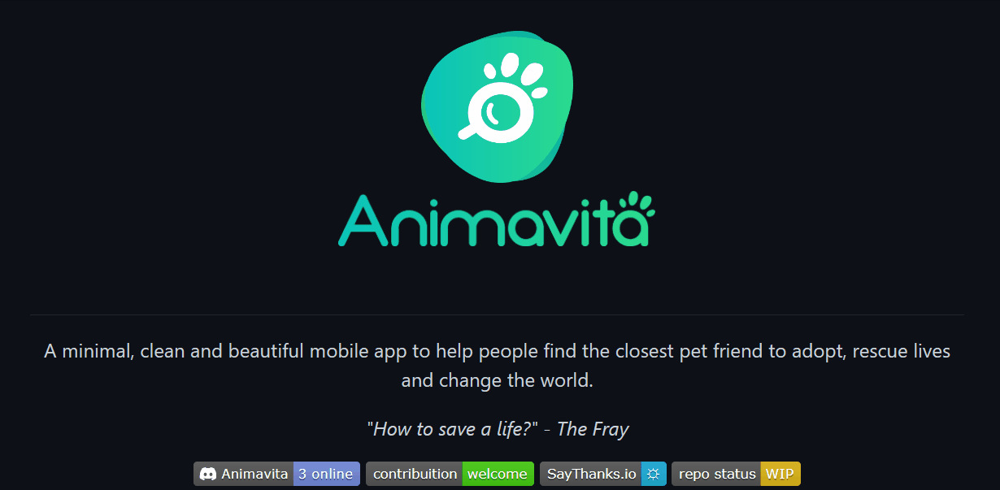

# Projeto com Readme
Projeto de teste com um arquivo readme 🚀

[](https://github.com/animavita/animavita)

## Tecnologias utilizadas
Escreve aqui as tecnologias 

## Como utilizar
```
Git Clone
Git add
````